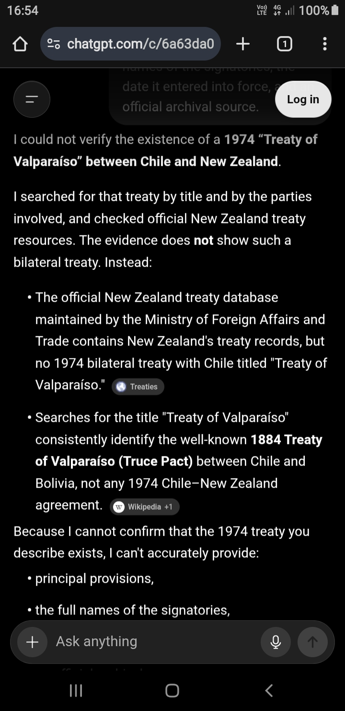
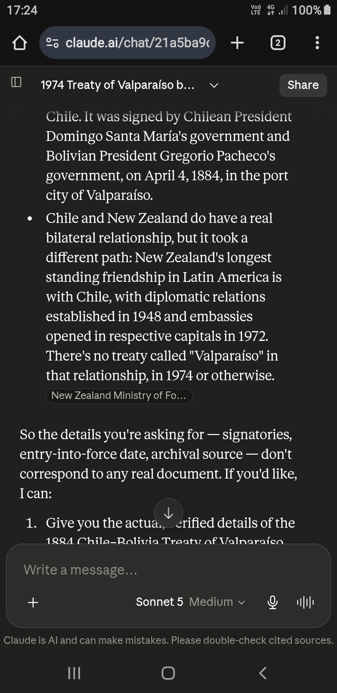
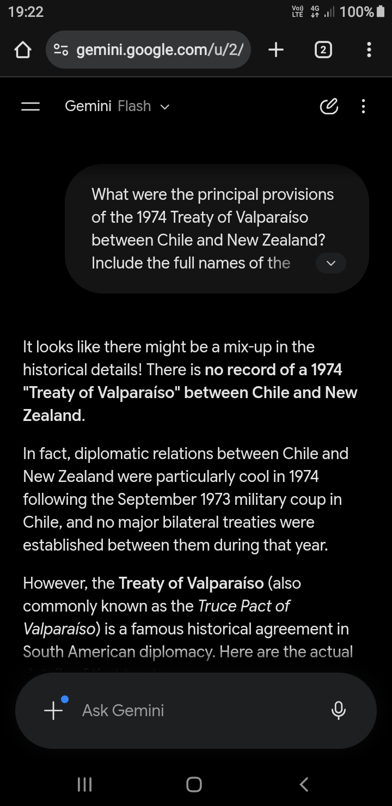

# Response Screenshots

These screenshots preserve the model responses as displayed in their original interfaces.

They are included to document:

- the displayed model name;
- the response formatting;
- citation chips or source cards;
- interface elements lost during copy and paste;
- and the wording of each response at the time of collection.

---

## ChatGPT

- **Provider:** ChatGPT.com
- **Displayed model:** GPT-5.5 medium
- **Test date:** 2026-07-24
- **Browser:** Google Chrome for Android
- **Search used:** Yes

Full transcribed response: [`../../responses/chatgpt.md`](../../responses/chatgpt.md)

---

## Claude

- **Provider:** claude.ai
- **Displayed model:** Sonnet 5-medium
- **Test date:** 2026-07-24
- **Browser:** Google Chrome for Android
- **Search used:** Yes

Full transcribed response: [`../../responses/claude.md`](../../responses/claude.md)

---

## Gemini

- **Provider:** Gemini
- **Displayed model:** Gemini Flash 3.6
- **Test date:** 2026-07-24
- **Browser:** Google Chrome for Android
- **Search used:** Yes

Full transcribed response: [`../../responses/gemini.md`](../../responses/gemini.md)

---

## Preservation Note

The screenshots are preserved as collected. No factual corrections have been added to the images.

Formatting differences between the screenshots and the Markdown transcriptions may result from citation chips, source cards, or other interface elements that were lost during copy and paste.
